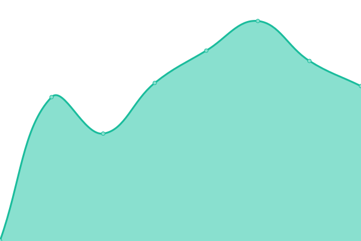
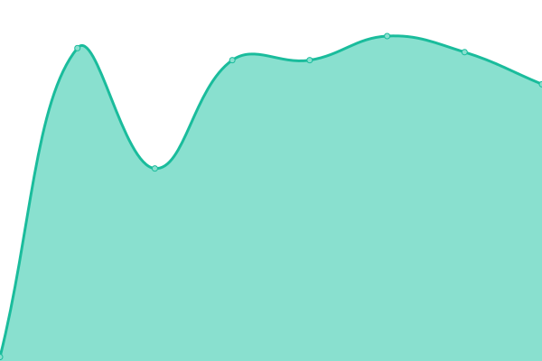
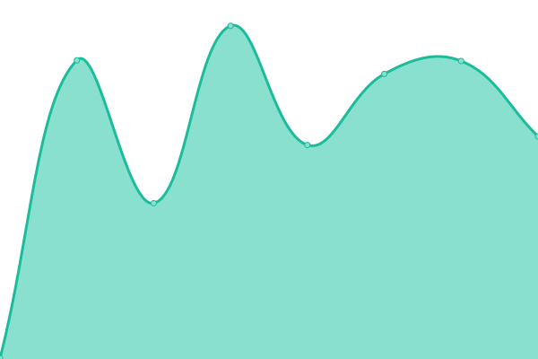

# [📈 Live Status](https://origon-cloud.github.io/literax-status): <!--live status--> **🟧 Partial outage**

This repository contains the open-source uptime monitor and status page for [Origon](https://origon-cloud.github.io/literax-status), powered by [Upptime](https://github.com/upptime/upptime).

With [Upptime](https://upptime.js.org), you can get your own unlimited and free uptime monitor and status page, powered entirely by a GitHub repository. We use [Issues](https://github.com/origon-cloud/literax-status/issues) as incident reports, [Actions](https://github.com/origon-cloud/literax-status/actions) as uptime monitors, and [Pages](https://origon-cloud.github.io/literax-status) for the status page.

<!--start: status pages-->
<!-- This summary is generated by Upptime (https://github.com/upptime/upptime) -->
<!-- Do not edit this manually, your changes will be overwritten -->
<!-- prettier-ignore -->
| URL | Status | History | Response Time | Uptime |
| --- | ------ | ------- | ------------- | ------ |
|  [Literax-QA](https://literaxqa.origon.cloud/) | 🟩 Up | [literax-qa.yml](https://github.com/origon-cloud/literax-status/commits/HEAD/history/literax-qa.yml) | 

 466ms
     
 | 

<a href="https://origon-cloud.github.io/literax-status/history/literax-qa">100.00%</a>
    

|  [Literax-QA_chat-script](https://front.literaxqa.origon.app/chat_element/lit-chat.min.js) | 🟩 Up | [literax-qa-chat-script.yml](https://github.com/origon-cloud/literax-status/commits/HEAD/history/literax-qa-chat-script.yml) | 

 1716ms
     
 | 

<a href="https://origon-cloud.github.io/literax-status/history/literax-qa-chat-script">100.00%</a>
    

|  [Literax-QA_drive-script](https://front.literaxqa.origon.app/widget/lit-drive.min.js) | 🟩 Up | [literax-qa-drive-script.yml](https://github.com/origon-cloud/literax-status/commits/HEAD/history/literax-qa-drive-script.yml) | 

 1350ms
     
 | 

<a href="https://origon-cloud.github.io/literax-status/history/literax-qa-drive-script">99.78%</a>
    

|  [Literax-QA_onlyoffice-script](https://texteditor.literaxqa.origon.app/web/js/webcomponent.onlyoffice.min.js) | 🟩 Up | [literax-qa-onlyoffice-script.yml](https://github.com/origon-cloud/literax-status/commits/HEAD/history/literax-qa-onlyoffice-script.yml) | 

 456ms
     
 | 

<a href="https://origon-cloud.github.io/literax-status/history/literax-qa-onlyoffice-script">100.00%</a>
    

|  [Literax-QA_api](https://api.literaxqa.origon.app/api/v2/users) | 🟩 Up | [literax-qa-api.yml](https://github.com/origon-cloud/literax-status/commits/HEAD/history/literax-qa-api.yml) | 

 907ms
     
 | 

<a href="https://origon-cloud.github.io/literax-status/history/literax-qa-api">100.00%</a>
    

|  [Literax-QA_signature-widget](https://front.literaxqa.origon.app/widgets/) | 🟩 Up | [literax-qa-signature-widget.yml](https://github.com/origon-cloud/literax-status/commits/HEAD/history/literax-qa-signature-widget.yml) | 

 86ms
     
 | 

<a href="https://origon-cloud.github.io/literax-status/history/literax-qa-signature-widget">100.00%</a>
    

|  [Literax-DEMO](https://literaxdemo.origon.cloud/) | 🟩 Up | [literax-demo.yml](https://github.com/origon-cloud/literax-status/commits/HEAD/history/literax-demo.yml) | 

 1511ms
     
 | 

<a href="https://origon-cloud.github.io/literax-status/history/literax-demo">100.00%</a>
    

|  [Literax-DEMO_chat-script](https://front.literaxdemo.origon.app/chat_element/lit-chat.min.js) | 🟩 Up | [literax-demo-chat-script.yml](https://github.com/origon-cloud/literax-status/commits/HEAD/history/literax-demo-chat-script.yml) | 

 1177ms
     
 | 

<a href="https://origon-cloud.github.io/literax-status/history/literax-demo-chat-script">100.00%</a>
    

|  [Literax-DEMO_drive-script](https://front.literaxdemo.origon.app/widget/lit-drive.min.js) | 🟥 Down | [literax-demo-drive-script.yml](https://github.com/origon-cloud/literax-status/commits/HEAD/history/literax-demo-drive-script.yml) | 

 66ms
     
 | 

<a href="https://origon-cloud.github.io/literax-status/history/literax-demo-drive-script">0.00%</a>
    

|  [Literax-DEMO_api](https://api.literaxdemo.origon.app/api/v2/users) | 🟩 Up | [literax-demo-api.yml](https://github.com/origon-cloud/literax-status/commits/HEAD/history/literax-demo-api.yml) | 

 1128ms
     
 | 

<a href="https://origon-cloud.github.io/literax-status/history/literax-demo-api">100.00%</a>
    

|  [Literax-DEMO_signature-widget](https://front.literaxdemo.origon.app/widgets/) | 🟩 Up | [literax-demo-signature-widget.yml](https://github.com/origon-cloud/literax-status/commits/HEAD/history/literax-demo-signature-widget.yml) | 

 69ms
     
 | 

<a href="https://origon-cloud.github.io/literax-status/history/literax-demo-signature-widget">100.00%</a>
    

<!--end: status pages-->

[**Visit our status website →**](https://origon-cloud.github.io/literax-status)

## 📄 License

- Powered by: [Upptime](https://github.com/upptime/upptime)
- Code: [MIT](./LICENSE) © [Origon](https://origon-cloud.github.io/literax-status)
- Data in the `./history` directory: [Open Database License](https://opendatacommons.org/licenses/odbl/1-0/)
